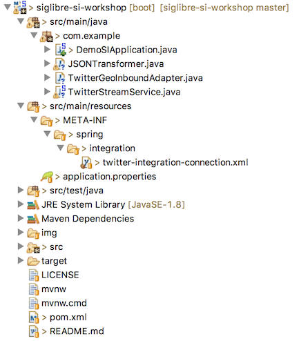
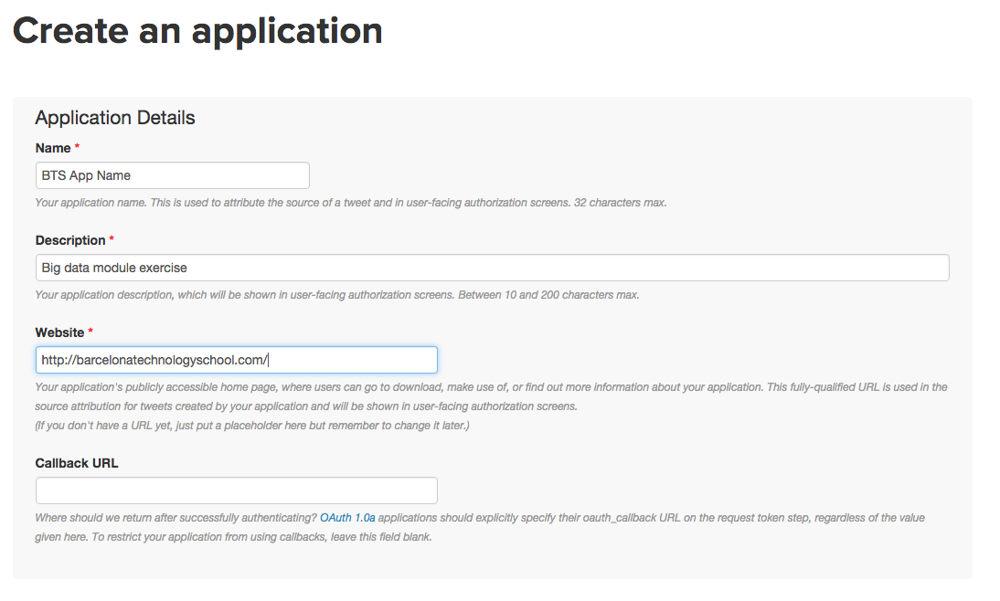

# Stream Data Ingestion Workshop

This is an exemple for the hands on session for SIGLibre.

We will create together a project in Spring integration framework to collect GEO data from twitter API and feed a MongoDB.

### Set Up your development environment

 - Open VirtualBOX and run the VM.
 - Run STS: 

	$> ./STS/sts-bundle/sts-3.7.3.RELEASE/STS

- Install Mongodb:

	$> sudo apt-get update
	$> sudo apt-get install mongodb

### Clone and develop the application

Clone this project in your terminal or Git Shell:

	$ git clone https://github.com/djkram/siglibre-si-workshop.git

Clone using STS:

	File > Import > Git > Projects from Git > Clone Uri

### Explore the the application

We Will work on:
- **pom.xml** : for manage dependencies
- **twitter-integration-connection.xml** : for spring integration configuration
- **application.properties** : for external variables
- **src/man/java > com.example** : to implement nedded classes

#### Technologies

On this whorkshop we will use:

- Maven
- Spring Boot
- Spring Integration
- TwitterAPI and Twitter4j
- MongoDB

## Hands On workshop Step by Step

### Step 1: Configuring the dependencies:

exploring the **pom.xml**

### Step 2: Understanding Spring Integration

Reference documentation of spring integration: [http://docs.spring.io/spring-integration/reference/htmlsingle/](http://docs.spring.io/spring-integration/reference/htmlsingle/)

- Read the [Part III](http://docs.spring.io/spring-integration/reference/htmlsingle/#spring-integration-introduction) for an overview.

- Read the [Part IV](http://docs.spring.io/spring-integration/reference/htmlsingle/#spring-integration-core-messaging) for a deep detail.

- Read the [Part V](http://docs.spring.io/spring-integration/reference/htmlsingle/#spring-integration-endpoints) to know the endpoints supported.

Open the configuration file: 

	src/main/resources/twitter-integration-connection.xml
	

Contains this data ingestion flow:

### Create an App for Twitter API access

Go to: [https://apps.twitter.com/](https://apps.twitter.com/)

Complete the form:

Go To Tokens Tab:

Get your Keys:

Active your Tokens:

Get your Tokens:

	
#### Set UP your Twitter Api Credentials

Open the properties file: 

	src/main/resources/application.properties

Set your credentials:

	twitter.oauth.consumerKey=
	twitter.oauth.consumerSecret=
	twitter.oauth.accessToken=20428117-
	twitter.oauth.accessTokenSecret=
	twitter.search.query=

### HOMEWORK

- Modify this project to store the tweets on a file

- File endpoint Reference (outbound): [http://docs.spring.io/spring-integration/reference/htmlsingle/#file-writing](http://docs.spring.io/spring-integration/reference/htmlsingle/#file-writing)

- configuration file example: [https://github.com/spring-projects/spring-integration-samples/blob/master/basic/file/src/main/resources/META-INF/spring/integration/fileCopyDemo-file.xml](https://github.com/spring-projects/spring-integration-samples/blob/master/basic/file/src/main/resources/META-INF/spring/integration/fileCopyDemo-file.xml)

- **Create a Git repository in GitHub, push your project and send the link to your teacher.**

- How to push a Git to GItHub: [https://help.github.com/articles/adding-an-existing-project-to-github-using-the-command-line/](https://help.github.com/articles/adding-an-existing-project-to-github-using-the-command-line/)